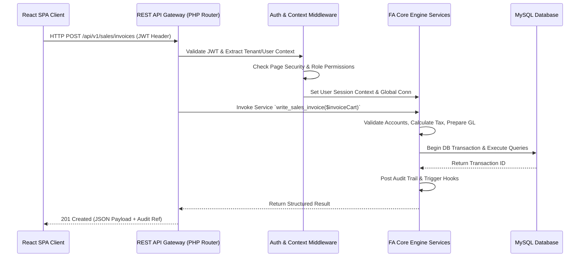
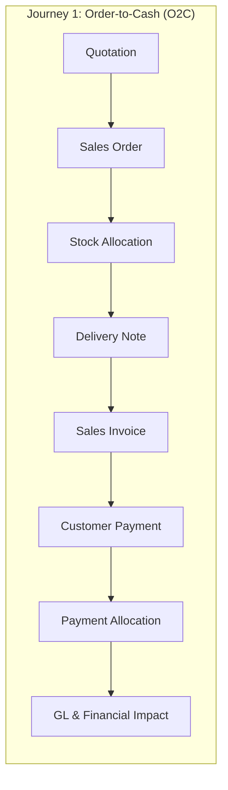
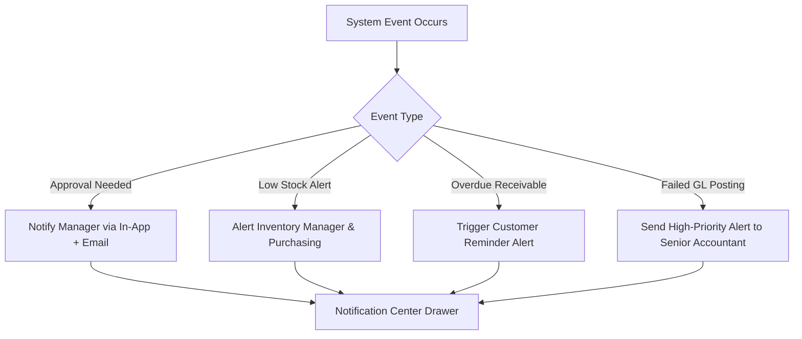
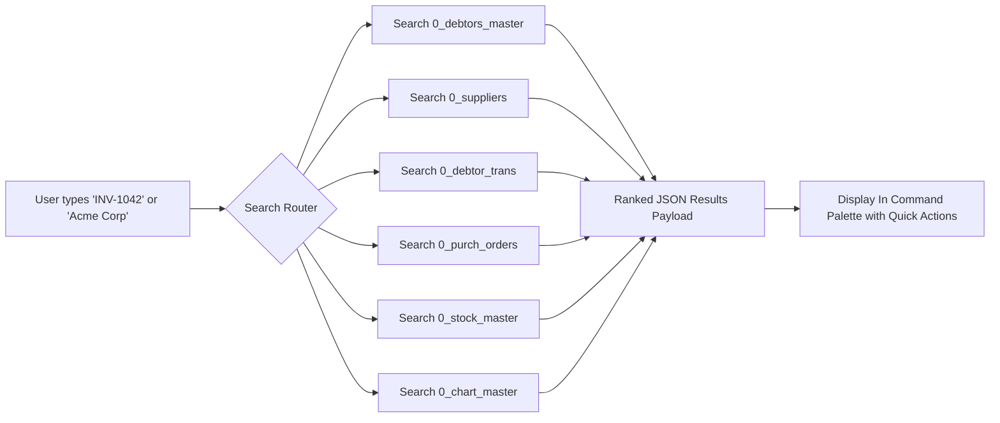

# Document 1: Enterprise Architecture, Business Process & Platform Strategy

## FrontAccounting ERP v2.4.20 — Enterprise Modernization Blueprint

---

# Executive Architectural Vision: The Platform Paradigm Shift

> [!IMPORTANT]
> **Core Architectural Principle:** We are NOT merely executing a "UI reskin" or a cosmetic frontend refactor of FrontAccounting. We are architecting a **Next-Generation Enterprise ERP Platform** built around FrontAccounting’s battle-tested, immutable double-entry accounting engine.

```
┌─────────────────────────────────────────────────────────────────────────────────────────┐
│                          NEXT-GENERATION REACT PRESENTATION LAYER                        │
│   Command Palette │ Workspaces │ Real-Time Dashboards │ Interactive Grids │ Modern UX   │
└───────────────────────────────────────────┬─────────────────────────────────────────────┘
                                            │ REST / JSON API (JWT + OpenAPI 3.0)
┌───────────────────────────────────────────▼─────────────────────────────────────────────┐
│                          ENTERPRISE ERP PLATFORM SERVICES LAYER                         │
│  State Machine Workflow Engine │ Notification Service │ Audit Log │ Async Task Queue    │
└───────────────────────────────────────────┬─────────────────────────────────────────────┘
                                            │ Native PHP Interop / Service Wrappers
┌───────────────────────────────────────────▼─────────────────────────────────────────────┐
│                     IMMUTABLE FRONTACCOUNTING CORE ACCOUNTING ENGINE                    │
│  Double-Entry GL │ Tax Calculation │ Inventory Costing │ Currency & FX │ Audit Trail    │
└───────────────────────────────────────────┬─────────────────────────────────────────────┘
                                            │ MySQL / MariaDB (InnoDB)
┌───────────────────────────────────────────▼─────────────────────────────────────────────┐
│                               RELATIONAL DATA STORE (0_* Tables)                        │
└─────────────────────────────────────────────────────────────────────────────────────────┘
```

By cleanly decoupling the **Presentation & Workflow Orchestration Layer** from the **Immutable Core Engine**, we ensure 100% accounting fidelity and zero risk to historical ledger integrity while completely transforming user experience, automation, integration capability, and operational speed.

---

# Part 1: Overall Architecture & Core Engine

## 1.1 Architectural Baseline

FrontAccounting (v2.4.20) operates as a monolithic PHP application without an external MVC framework. Each function resides in page scripts or procedural helper files.

### Key Architectural Characteristics
| Attribute | Legacy State | Modernized Platform Architecture |
|---|---|---|
| **Architecture** | Monolithic Procedural Page-Controller | Decoupled API-Driven Architecture (headless core + React SPA) |
| **State Management** | Server-side PHP `$_SESSION` | Server: Stateless REST (JWT) + React Query server-state cache |
| **Routing** | Native Filesystem Paths (`/sales/customer_invoice.php`) | Client-side TanStack Router with Type Safety |
| **Data Interchange** | HTML Page Renders & Custom `JsHttpRequest` AJAX | Standardized JSON REST API with OpenAPI 3.0 specs |
| **ORM / Data Access** | Raw SQL queries with `db_query()` | Preserved SQL routines wrapped in Typed Repository Services |
| **Styling & Layout** | HTML `<table>` layouts with static CSS files | Tailwind CSS + Design System Token System + CSS Grid |
| **Task Execution** | Synchronous HTTP execution | Async Background Queue for heavy posting/reports |

---

## 1.2 Bootstrap Process & Request Lifecycle

The legacy initialization chain relies on continuous script inclusions starting from [index.php](file:///d:/VibeCode/FA%202%20new/FA-Source/index.php). In the modernized platform, this lifecycle is adapted into a REST API Gateway middleware pipeline:



---

# Part 2: End-to-End User Journey Analysis

Rather than viewing the ERP as isolated pages, accountants and business operators execute continuous, multi-step business journeys. The modernized system unifies these disconnected pages into fluid, tabbed, and guided workspaces.



## 2.1 Primary Enterprise User Journeys

### Journey 1: Order-to-Cash (Sales Accountant & Fulfillment Specialist)
1. **Prospect Quote**: Create Quotation with real-time stock availability and custom pricing check.
2. **Order Conversion**: Convert Quote to Sales Order with 1-click; reserve inventory automatically.
3. **Fulfillment**: Warehouse receives alert; generates Delivery Note & packing slip; updates stock on hand.
4. **Invoicing**: Auto-generate Invoice from Delivery Note. Tax and receivables GL entries posted instantly.
5. **Collection**: Cashier logs Customer Payment against invoice; engine calculates early settlement discount or foreign currency gains/losses.
6. **Reconciliation**: Auto-allocates payment to open invoice; updates Customer Aged Receivables report.

### Journey 2: Procure-to-Pay (Purchasing Officer & Accounts Payable)
1. **Requisition / PO**: Raise Purchase Order based on reorder thresholds.
2. **Goods Receipt**: Receive items via Goods Received Note (GRN); inventory quantity increases immediately.
3. **Supplier Invoice Matching**: Match Supplier Invoice to GRN & PO; system checks for price/qty variance against thresholds.
4. **AP Payment**: Process batch or single Supplier Payment; generate Remittance Advice PDF.
5. **GL Impact**: AP account credited on invoice, debited on payment; GRN clearing account reconciled.

### Journey 3: Record-to-Report (Senior Accountant & CFO)
1. **Period Operations**: Review daily journal entries, recurring accruals, bank feeds.
2. **Bank Reconciliation**: Match bank statement lines with system bank transactions; calculate exchange variance.
3. **Closing Checks**: Audit unallocated payments, draft invoices, stock adjustments.
4. **Period Lock**: Lock fiscal period to prevent backdated postings.
5. **Financial Statements**: Generate interactive Trial Balance, P&L, and Balance Sheet with instant drill-down to underlying GL transactions.

---

# Part 3: Comprehensive Reusable UI Component Inventory

To prevent UI redundancy and build a unified React architecture, every legacy UI element across FrontAccounting's 50+ screens is mapped to a standardized Component System:

| Legacy UI Element | Description in FA | Target React Component | Component Category | Reuse Level |
|---|---|---|---|---|
| `combo_input()` / `ui_lists.inc` | Dropdown for accounts, customers, suppliers | `<AsyncSelectFetch>` / `<SearchableCombobox>` | ERP-Specific Component | Universal |
| `amount_cells()` / `amount_row()` | Money input field with precision | `<CurrencyInput>` | Form Component | Universal |
| `date_cells()` | Date picker with system format | `<DatePicker>` / `<DateRangePicker>` | Form Component | Universal |
| `start_table()` / `end_table()` | Table container styling | `<DataTable>` / `<ResponsiveGrid>` | Layout Component | Universal |
| `display_db_pager()` | Server-side table pagination | `<PaginationControls>` | Shared Component | Universal |
| `gl_all_accounts_list()` | GL Chart of Accounts dropdown | `<AccountSelector>` | ERP-Specific Component | Universal |
| `stock_items_list()` | Product selector dropdown | `<ItemLookupCombobox>` | ERP-Specific Component | Universal |
| `customer_branches_list()` | Customer branch selector | `<BranchSelector>` | ERP-Specific Component | High |
| Journal Line Grid | Dynamic rows for Debit/Credit | `<JournalEntryGrid>` | ERP-Specific Component | Core GL |
| Cart Items Table | Invoice/SO line item editor | `<EditableDocLineGrid>` | ERP-Specific Component | Sales/Purchasing |
| `hyperlink_params()` | Action link back/forward | `<ActionButton>` / `<IconButton>` | Shared Component | Universal |
| `status_box()` / Error box | System alerts & validation errors | `<AlertNotification>` / `<Toast>` | Feedback Component | Universal |
| `print_document_link()` | Link to PDF report | `<PrintPreviewModal>` / `<PDFViewer>` | Report/Print Component | Universal |

---

# Part 4: Navigation Architecture & Command Center

The legacy navigation relies on 7 horizontal tabs with text link clusters. The modernized platform introduces an enterprise-grade command center navigation architecture.

```
┌─────────────────────────────────────────────────────────────────────────────────────────┐
│ TOP BAR: [Logo]  [Workspace Selector ▾]  [🔍 Global Search / Cmd+K]  [🔔 Notifications] [👤 User] │
├─────────────┬───────────────────────────────────────────────────────────────────────────┤
│ SIDEBAR     │ MAIN WORKSPACE VIEWPORT                                                   │
│             │                                                                           │
│ ⭐ Favorites │ 🏠 Dashboard / Sales Workspace                                           │
│ 📌 Pinned    │ ┌───────────────────────────────────────────────────────────────────────┐ │
│ 🕒 Recent    │ │ Breadcrumbs: Sales / Invoices / INV-2026-0042                         │ │
│ ─── MODULES  │ ├───────────────────────────────────────────────────────────────────────┤ │
│ 🛒 Sales    │ │ Action Bar: [ + New Invoice ]  [ Export ▾ ]  [ Print ]  [ Audit Log ]   │ │
│ 📦 Purchase │ └───────────────────────────────────────────────────────────────────────┘ │
│ 🏭 Inventory│                                                                           │
│ 🛠️ Manuf.   │                                                                           │
│ 💰 Banking  │                                                                           │
│ 📊 Ledger   │                                                                           │
│ ⚙️ Setup    │                                                                           │
└─────────────┴───────────────────────────────────────────────────────────────────────────┘
```

### Key Navigation Capabilities
1. **Command Palette (`Cmd + K` / `Ctrl + K`)**: Instant access to any page, action, customer, transaction, or report in 2 keystrokes.
2. **Workspace Navigation**: Dedicated contextual views for Sales, Purchasing, Inventory, and General Ledger.
3. **Favorites & Pinned Views**: Users can pin frequently used screens or saved query filters to their sidebar.
4. **Recent Items Drawer**: Quick access to the last 20 viewed invoices, customers, or journal entries.
5. **Breadcrumb Trail**: Smart hierarchy tracking (`Sales > Invoices > INV-2026-0042`).

---

# Part 5: Granular Role-Based Permission Matrix

FrontAccounting's security areas are mapped into an explicit 8-Role Enterprise Action Matrix:

```
R = Read/View | C = Create | U = Update | D = Delete | A = Approve | P = Print | E = Export | API = API Access
```

| Module / Entity | Admin | Senior Accountant | Cashier | Sales Agent | Inventory Mgr | Auditor | Manager | Guest |
|---|---|---|---|---|---|---|---|---|
| **Sales Orders** | R C U D A P E API | R C U P E API | R P | R C U P | R P | R P E | R C U A P E API | R |
| **Sales Invoices** | R C U D A P E API | R C U P E API | R P | R C P | R P | R P E | R P E API | - |
| **Customer Payments**| R C U D A P E API | R C U P E API | R C P E API | R | - | R P E | R P E | - |
| **Purchase Orders** | R C U D A P E API | R C P E API | - | - | R C U P E | R P E | R C U A P E API | - |
| **Supplier Invoices**| R C U D A P E API | R C U P E API | - | - | R P | R P E | R P E API | - |
| **GL Journal** | R C U D A P E API | R C U A P E API | - | - | - | R P E | R P E API | - |
| **Bank Reconciliation**| R C U D A P E API| R C U P E API | - | - | - | R P E | R P E API | - |
| **Stock Adjustments**| R C U D A P E API | R P E | - | - | R C U A P E | R P E | R P E API | - |
| **Financial Reports**| R C U D A P E API | R P E API | - | - | - | R P E | R P E API | - |
| **System Setup** | R C U D A P E API | R | - | - | - | R | R | - |

---

# Part 6: Complete REST Endpoint Map

Every legacy PHP script is mapped to a RESTful API specification:

### Authentication & System
- `POST /api/v1/auth/login` → Replaces `access/login.php` (Returns JWT + User Context)
- `POST /api/v1/auth/refresh` → Session renewal
- `GET /api/v1/system/preferences` → Replaces `admin/display_prefs.php`

### Sales Module Endpoints
- `GET /api/v1/sales/quotations` → Replaces `sales/inquiry/sales_orders_view.php?type=32`
- `POST /api/v1/sales/quotations` → Replaces `sales/sales_order_entry.php?NewQuotation=Yes`
- `GET /api/v1/sales/orders` → Replaces `sales/inquiry/sales_orders_view.php?type=30`
- `POST /api/v1/sales/orders` → Replaces `sales/sales_order_entry.php?NewOrder=Yes`
- `POST /api/v1/sales/deliveries` → Replaces `sales/customer_delivery.php`
- `GET /api/v1/sales/invoices` → Replaces `sales/inquiry/customer_inquiry.php`
- `POST /api/v1/sales/invoices` → Replaces `sales/customer_invoice.php` (Executes `write_sales_invoice()`)
- `POST /api/v1/sales/invoices/{id}/void` → Replaces `admin/void_transaction.php`
- `POST /api/v1/sales/payments` → Replaces `sales/customer_payments.php`
- `POST /api/v1/sales/allocations` → Replaces `sales/allocations/customer_allocation_main.php`

### Purchasing Module Endpoints
- `GET /api/v1/purchasing/orders` → Replaces `purchasing/inquiry/po_search_completed.php`
- `POST /api/v1/purchasing/orders` → Replaces `purchasing/po_entry_items.php`
- `POST /api/v1/purchasing/grn` → Replaces `purchasing/po_receive_items.php`
- `POST /api/v1/purchasing/invoices` → Replaces `purchasing/supplier_invoice.php`
- `POST /api/v1/purchasing/payments` → Replaces `purchasing/supplier_payment.php`

### General Ledger & Banking Endpoints
- `GET /api/v1/gl/accounts` → Replaces `gl/inquiry/gl_account_inquiry.php`
- `POST /api/v1/gl/journals` → Replaces `gl/gl_journal.php` (Executes `write_journal_entries()`)
- `POST /api/v1/gl/bank-payments` → Replaces `gl/gl_bank.php?NewPayment=Yes`
- `POST /api/v1/gl/bank-transfers` → Replaces `gl/bank_transfer.php`
- `POST /api/v1/gl/reconcile` → Replaces `gl/bank_account_reconcile.php`

### Reports & Print Endpoints
- `GET /api/v1/reports/balance-sheet` → Replaces `reporting/rep706.php`
- `GET /api/v1/reports/profit-and-loss` → Replaces `reporting/rep707.php`
- `GET /api/v1/reports/trial-balance` → Replaces `reporting/rep708.php`
- `GET /api/v1/reports/documents/{type}/{id}/pdf` → Replaces `reporting/prn_redirect.php`

---

# Part 7: State Management Architecture

A robust, enterprise React application requires a clear division of state boundaries:

```
┌─────────────────────────────────────────────────────────────────────────────────────────┐
│ 1. SERVER STATE (TanStack Query / React Query)                                          │
│    • GL Accounts list, Customer master data, Item stock balances, Search results         │
│    • Cache strategy: Stale-While-Revalidate, Automatic background refetching            │
├─────────────────────────────────────────────────────────────────────────────────────────┤
│ 2. GLOBAL CLIENT STATE (Zustand / Redux Toolkit)                                       │
│    • User Auth Session (JWT, Permissions, Current Company ID)                            │
│    • Active Workspace Tab list, Navigation Sidebar state                                 │
│    • Global Command Palette open/closed state                                           │
├─────────────────────────────────────────────────────────────────────────────────────────┤
│ 3. LOCAL FORM & TRANSACTION STATE (React Hook Form + Zod Schema Validation)             │
│    • Active Invoice Line Items Cart (in-memory document creation)                        │
│    • Journal Entry Debit/Credit balancing calculations                                   │
│    • Draft Auto-Save to LocalStorage / IndexedDB                                        │
├─────────────────────────────────────────────────────────────────────────────────────────┤
│ 4. OPTIMISTIC UPDATES & BACKGROUND SYNC                                                 │
│    • Instant UI update on payment allocation or item addition                            │
│    • Rollback with error toast if API transaction returns non-zero error code           │
└─────────────────────────────────────────────────────────────────────────────────────────┘
```

---

# Part 8: Business Process Workflow Engine & State Machines

Modern ERPs manage business rules via formal State Machines. The diagram below documents the Quotation-to-Payment Lifecycle State Machine:

```mermaid
stateDiagram-v8
    [*] --> DraftQuotation: User Creates Quote
    DraftQuotation --> ApprovedQuote: Manager Approval (Optional)
    DraftQuotation --> Cancelled: Cancelled / Expired
    ApprovedQuote --> SalesOrder: Convert to Order (Stock Reserved)
    SalesOrder --> PartialDelivery: Partial Dispatch
    SalesOrder --> FullDelivery: Full Dispatch (Stock Deducted)
    PartialDelivery --> FullDelivery: Remaining Items Dispatched
    FullDelivery --> Invoiced: Auto-Generate Sales Invoice (GL Posted)
    Invoiced --> PartiallyPaid: Partial Payment Logged
    Invoiced --> FullyPaid: Full Payment Received
    PartiallyPaid --> FullyPaid: Outstanding Allocated
    FullyPaid --> Closed: Document Reconciled & Closed
    Closed --> [*]
```

---

# Part 9: Enterprise Notification & Alert System

To transform static ERP interactions into a proactive collaborative workflow, the modern platform implements an Enterprise Notification Engine:



### Notification Types
- **Approval Tasks**: Purchase orders > $5,000, manual GL entries to restricted accounts, credit limit overrides.
- **Operational Alerts**: Items falling below reorder quantity, customer reaching credit threshold.
- **System Events**: Successful night batch backups, failed background posting jobs.

---

# Part 10: Dashboard Specification & Widget Catalog

The modern landing view provides a role-customizable financial intelligence dashboard:

```
┌─────────────────────────────────────────────────────────────────────────────────────────┐
│ FINANCIAL KPI BAR                                                                       │
│ ┌──────────────┐ ┌──────────────┐ ┌──────────────┐ ┌──────────────┐ ┌──────────────┐ │
│ │ Total Revenue│ │ Total Expense│ │ Net Margin   │ │ Bank Balance │ │ Overdue Rec. │ │
│ │ $1,248,500   │ │ $842,100     │ │ 32.5%        │ │ $412,900     │ │ $68,400      │ │
│ └──────────────┘ └──────────────┘ └──────────────┘ └──────────────┘ └──────────────┘ │
├───────────────────────────────────────────┬─────────────────────────────────────────────┤
│ WIDGET 1: Monthly Cash Flow (Recharts)   │ WIDGET 2: Pending Approval Queue            │
│ [Bar Chart: Inflows vs Outflows]         │ • PO-2026-0091 ($12,400) — [Approve] [Reject]│
│                                           │ • JV-2026-0014 ($50,000) — [Review]         │
├───────────────────────────────────────────┼─────────────────────────────────────────────┤
│ WIDGET 3: Stock Shortage Alerts           │ WIDGET 4: Quick Action Launchpad            │
│ ⚠️ Product A001 (Qty: 2, Reorder: 10)     │ [ + Sales Order ]   [ + Supplier Invoice ]  │
│ ⚠️ Product B042 (Qty: 0, Reorder: 5)      │ [ + Journal Entry]  [ 📊 P&L Statement ]    │
└───────────────────────────────────────────┴─────────────────────────────────────────────┘
```

---

# Part 11: Universal Search & Command Palette Architecture

The Universal Search engine scans across all ERP entities from a single unified input bar:



---

# Part 12: Accounting Engine Immutability & Wrap Classification

*(Preserved and expanded from baseline analysis)*

All core double-entry accounting routines remain 100% untouched in code logic. The table below lists all core functions and confirms their strict operational status:

| Function | File Location | Operational Classification | Guarantee |
|---|---|---|---|
| `add_gl_trans()` | [gl_db_trans.inc:19](file:///d:/VibeCode/FA%202%20new/FA-Source/gl/includes/db/gl_db_trans.inc#L19) | 🔒 **Preserve Exactly** | Zero SQL/Logic Modification |
| `add_gl_balance()` | [gl_db_trans.inc:91](file:///d:/VibeCode/FA%202%20new/FA-Source/gl/includes/db/gl_db_trans.inc#L91) | 🔒 **Preserve Exactly** | Zero SQL/Logic Modification |
| `write_sales_invoice()`| [sales_invoice_db.inc:15](file:///d:/VibeCode/FA%202%20new/FA-Source/sales/includes/db/sales_invoice_db.inc#L15)| 🔒 **Preserve Exactly** | Service Wrapper Only |
| `write_customer_payment()`|[payment_db.inc](file:///d:/VibeCode/FA%202%20new/FA-Source/sales/includes/db/payment_db.inc)| 🔒 **Preserve Exactly** | Service Wrapper Only |
| `add_supp_invoice()` | [supp_trans_db.inc](file:///d:/VibeCode/FA%202%20new/FA-Source/purchasing/includes/db/supp_trans_db.inc)| 🔒 **Preserve Exactly** | Service Wrapper Only |
| `get_tax_for_items()` | [tax_calc.inc:144](file:///d:/VibeCode/FA%202%20new/FA-Source/taxes/tax_calc.inc#L144) | 🔒 **Preserve Exactly** | Zero SQL/Logic Modification |
| `to_home_currency()` | [gl_db_rates.inc](file:///d:/VibeCode/FA%202%20new/FA-Source/gl/includes/db/gl_db_rates.inc) | 🔒 **Preserve Exactly** | Zero SQL/Logic Modification |
| `round2()` | [current_user.inc:299](file:///d:/VibeCode/FA%202%20new/FA-Source/includes/current_user.inc#L299) | 🔒 **Preserve Exactly** | Zero SQL/Logic Modification |
| `add_audit_trail()` | [audit_trail_db.inc](file:///d:/VibeCode/FA%202%20new/FA-Source/includes/db/audit_trail_db.inc) | 🔒 **Preserve Exactly** | Audit Continuity Ensured |

---

# Part 13: Technical Debt & Remediation Inventory

| # | Legacy Vulnerability / Debt | Remediation in New Architecture | Priority |
|---|---|---|---|
| 1 | MD5 Password Hashing | Migrate to `password_hash()` with Bcrypt/Argon2id + JWT Tokens | 🔴 Critical |
| 2 | Missing CSRF Protection | Native Header-based Token Validation in REST Gateway | 🔴 Critical |
| 3 | Raw `$_GET`/`$_POST` Usage | Strict Zod Schema Input Sanitization & Parameterized Bindings | 🔴 Critical |
| 4 | Non-Responsive HTML Tables | Modern Responsive Flex/Grid React Layout System | 🟡 High |
| 5 | PHP `$_SESSION` State Storage | Stateless JWT Authorization + Client-side Cache | 🟡 High |
| 6 | No API Layer | Comprehensive OpenAPI 3.0 Standardized REST API | 🟡 High |
| 7 | Synchronous Report Generation | Async PDF Generation Worker Queue | 🟢 Medium |

---

*End of Document 1 (Enhanced & Expanded Edition).*
