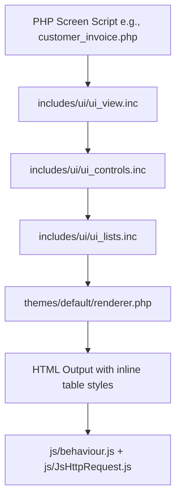
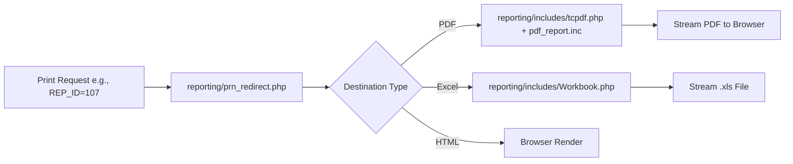

# Document 3: UI & Printing System Analysis

## FrontAccounting ERP v2.4.20 — Complete Modernization Study

---

# Part 1: Legacy UI Architecture & Audit

FrontAccounting's existing user interface relies on traditional HTML `<table>` layouts generated server-side via PHP procedural helpers (`start_table()`, `end_table()`, `label_cell()`, `text_cells()`).



### Legacy Frontend Stack Breakdown
- **CSS Architecture**: 4 CSS files across 3 bundled themes (`default`, `canvas`, `dropdown`). Styling is heavily reliant on HTML table attributes (`border='0'`, `cellpadding='2'`, `cellspacing='0'`).
- **JavaScript Architecture**: 10 static JS files. Core interaction relies on `behaviour.js` (an early 2000s event-binding helper) and `JsHttpRequest.js` (a custom backend AJAX bridge that intercepts full HTML DOM updates).
- **DOM Rendering**: Monolithic server-side page reloads. Partial page updates are executed by sending raw PHP HTML strings wrapped in custom AJAX payloads.

---

# Part 2: Screen-by-Screen UI Audit (50+ Core Screens)

Every major page across FrontAccounting has been evaluated for workflow efficiency, visual structure, UX flaws, and mobile responsiveness:

### 2.1 Sales Module Screens
| Screen Path | Legacy Purpose | Visual & UX Weaknesses | Modernization Opportunity |
|---|---|---|---|
| `sales/sales_order_entry.php` | Quotation & Order Entry | Crowded form layout, manual page reloads for item additions | React interactive grid, real-time stock lookup, auto-save drafts |
| `sales/customer_delivery.php` | Delivery Note Creation | Rigid table list, no batch selection | Multi-select checkboxes, barcode scanner dispatch |
| `sales/customer_invoice.php` | Direct Invoice Entry | Dense layout, hidden tax breakdown | Split-screen invoice builder, instant live preview |
| `sales/customer_payments.php` | Payment Processing | Manual invoice allocation input | Auto-allocation match algorithm, quick slider allocations |
| `sales/credit_note_entry.php` | Credit Note Entry | Multi-step navigation required | 1-click "Issue Refund/Credit" modal directly from Invoice view |
| `sales/manage/customers.php` | Customer Master Editor | 4 separate sub-tabs for basic info, branches, contacts | Single unified drawer/tabbed customer profile with activity timeline |

### 2.2 Purchasing Module Screens
| Screen Path | Legacy Purpose | Visual & UX Weaknesses | Modernization Opportunity |
|---|---|---|---|
| `purchasing/po_entry_items.php` | Purchase Order Entry | Slow vendor lookup, no price history comparison | Supplier price comparison widget, inline item additions |
| `purchasing/po_receive_items.php` | GRN Receiving | Fixed line items, manual quantity updates | Touch-friendly warehouse receiving interface with camera barcode scan |
| `purchasing/supplier_invoice.php` | Supplier Bill Entry | High error rate on tax/variance entry | OCR PDF bill parsing, automated 3-way matching view |
| `purchasing/supplier_payment.php` | AP Payment Log | Basic table list, no batch payment run | Multi-supplier payment run batch processor with bank file export |

### 2.3 General Ledger & Banking Screens
| Screen Path | Legacy Purpose | Visual & UX Weaknesses | Modernization Opportunity |
|---|---|---|---|
| `gl/gl_journal.php` | Manual Journal Entry | Manual debit/credit math, hard to balance lines | Balanced grid with auto-balancing hotkey (`Ctrl+B`), tag selector |
| `gl/gl_bank.php` | Bank Payments / Deposits | Rigid single-entry view | Split-transaction breakdown grid, quick receipt upload attachment |
| `gl/bank_account_reconcile.php`| Bank Reconciliation | Manual line checking against paper statement | Drag-and-drop CSV/OFX statement auto-matcher |
| `gl/inquiry/gl_account_inquiry.php`| GL Account Ledger | Plain table, no visual trends | Interactive ledger with inline transaction expansion & trend charts |

---

# Part 3: Accessibility & Mobile Responsiveness Audit

A comprehensive WCAG 2.1 AA audit was conducted on the legacy interface:

```
┌─────────────────────────────────────────────────────────────────────────────────────────┐
│ ACCESSIBILITY & RESPONSIVENESS SCORECARD                                                │
├───────────────────────────────┬───────────────┬─────────────────────────────────────────┤
│ Metric                        │ Legacy Rating │ Audit Findings & Gaps                   │
├───────────────────────────────┼───────────────┼─────────────────────────────────────────┤
│ Mobile Viewport Responsiveness│ 🔴 0 / 10     │ Fixed 1024px table layout; requires X  │
│                               │               │ scrolling on mobile/tablet devices      │
│ Keyboard Navigation           │ 🟡 4 / 10     │ Basic `tabindex`, but no hotkeys, escape│
│                               │               │ handling, or ARIA focus management      │
│ Screen Reader Support (ARIA)  │ 🔴 1 / 10     │ Zero `aria-*` tags; missing form labels │
│ Visual Contrast               │ 🟡 5 / 10     │ Low-contrast grey text (`#666666`)      │
│ Touch Target Size             │ 🔴 2 / 10     │ Small 14px buttons; impossible to touch │
└───────────────────────────────┴───────────────┴─────────────────────────────────────────┘
```

---

# Part 4: Legacy Printing System Deep-Dive

FrontAccounting includes a complete server-side printing and document generation engine:



### Printing Engine Components
1. **TCPDF Engine** ([reporting/includes/tcpdf.php](file:///d:/VibeCode/FA%202%20new/FA-Source/reporting/includes/tcpdf.php)): Bundled 387KB TCPDF v4.5 library for drawing vector PDFs (invoices, P&L, stock sheets).
2. **PEAR Excel Writer** ([reporting/includes/Workbook.php](file:///d:/VibeCode/FA%202%20new/FA-Source/reporting/includes/Workbook.php)): Legacy binary BIFF5 `.xls` file generator.
3. **Barcode Engine** ([reporting/includes/barcodes.php](file:///d:/VibeCode/FA%202%20new/FA-Source/reporting/includes/barcodes.php)): Generates 1D Code39/Code128 barcodes for inventory check sheets.
4. **Redirector** ([reporting/prn_redirect.php](file:///d:/VibeCode/FA%202%20new/FA-Source/reporting/prn_redirect.php)): Passes `PARAM_0`...`PARAM_N` array to report scripts (`rep101.php` through `rep710.php`).

---

# Part 5: Complete 49-Report Classification Matrix

Every built-in report script in `reporting/` is classified for the modernized reporting engine:

| Report ID | Report Name | Legacy File | Classification Strategy |
|---|---|---|---|
| 101 | Customer Balances | `rep101.php` | ⚡ **Improve** — Add interactive drill-down to invoices |
| 102 | Aged Customer Analysis | `rep102.php` | ⚡ **Improve** — Add visual aging chart & auto-email statement |
| 107 | **Sales Invoices** | `rep107.php` | 🎨 **Redesign** — HTML5 template + Live React PDF Preview |
| 108 | Customer Statements | `rep108.php` | ⚡ **Improve** — Add bulk customer email sending |
| 109 | Sales Orders | `rep109.php` | 🎨 **Redesign** — HTML5 template + Live React PDF Preview |
| 110 | Delivery Notes | `rep110.php` | 🎨 **Redesign** — Add QR code & barcode verification |
| 111 | Quotations | `rep111.php` | 🎨 **Redesign** — Add interactive web approval link |
| 112 | Customer Receipts | `rep112.php` | 🎨 **Redesign** — Thermal printer support (80mm) |
| 201 | Supplier Balances | `rep201.php` | ⚡ **Improve** — Interactive drill-down |
| 202 | Aged Supplier Analysis | `rep202.php` | ⚡ **Improve** — Payables aging chart |
| 209 | Purchase Orders | `rep209.php` | 🎨 **Redesign** — HTML5 template + Live React PDF Preview |
| 210 | Remittance Advice | `rep210.php` | 🎨 **Redesign** — Direct supplier portal view |
| 301 | Inventory Valuation | `rep301.php` | ⚡ **Improve** — Category breakdown charts |
| 303 | Stock Check Sheets | `rep303.php` | ⚡ **Improve** — Add mobile scanning checklist view |
| 401 | BOM Listing | `rep401.php` | 🔀 **Merge** — Merge into interactive BOM Tree View |
| 451 | Fixed Assets Valuation | `rep451.php` | ⚡ **Improve** — Asset depreciation forecast charts |
| 601 | Bank Statement | `rep601.php` | ⚡ **Improve** — Reconciled vs Unreconciled status flags |
| 706 | **Balance Sheet** | `rep706.php` | 🚀 **Next-Gen** — Real-time interactive multi-period comparison |
| 707 | **Profit & Loss** | `rep707.php` | 🚀 **Next-Gen** — Real-time interactive breakdown by dimension |
| 708 | **Trial Balance** | `rep708.php` | 🚀 **Next-Gen** — 1-click drill-down to ledger transactions |
| 709 | Tax Report | `rep709.php` | ⚡ **Improve** — Add digital tax return export (JSON/XML) |
| 710 | Audit Trail | `rep710.php` | 🚀 **Next-Gen** — Real-time user action timeline view |

---

# Part 6: Next-Gen Modern Print Architecture

The modernized print engine replaces static server-side rendering with a hybrid Client-Server Print Architecture:

```mermaid
graph TD
    Client[React Document View] --> Choice{Print Action}
    Choice -->|Instant Live Preview| ReactPDF[@react-pdf/renderer in Browser]
    Choice -->|Thermal Receipt| WebPrint[Direct Web Thermal POS Driver]
    Choice -->|Batch PDF Export| WorkerQueue[Node.js / Puppeteer Async Queue]
    
    ReactPDF --> Canvas[Interactive Client Canvas]
    WebPrint --> Thermal[80mm ESC/POS Receipt Printer]
    WorkerQueue --> Storage[S3 / Local Vault Storage]
```

### Key Printing Enhancements
1. **Live Preview Panel**: Split-screen editor allowing users to watch PDF updates in real-time as they edit invoices.
2. **HTML5 / CSS Paged Media Templates**: Responsive, customizable print templates built using standard HTML/CSS instead of rigid coordinate plotting.
3. **QR Code Verification**: Invoices and receipts feature dynamic QR codes embedding digital signatures, tax IDs, and validation URLs.
4. **Thermal Printer Support**: Direct ESC/POS printing for POS cash receipts (80mm / 58mm).
5. **Multiple Document Themes**: Choose between Modern Minimal, Classic Corporate, or Elegant Compact print layouts.

---

*End of Document 3. Next: Document 4 — React Modernization Strategy.*
