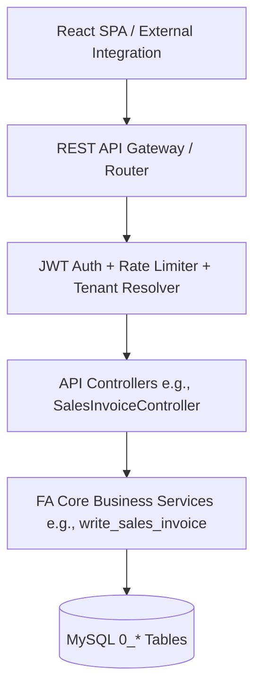
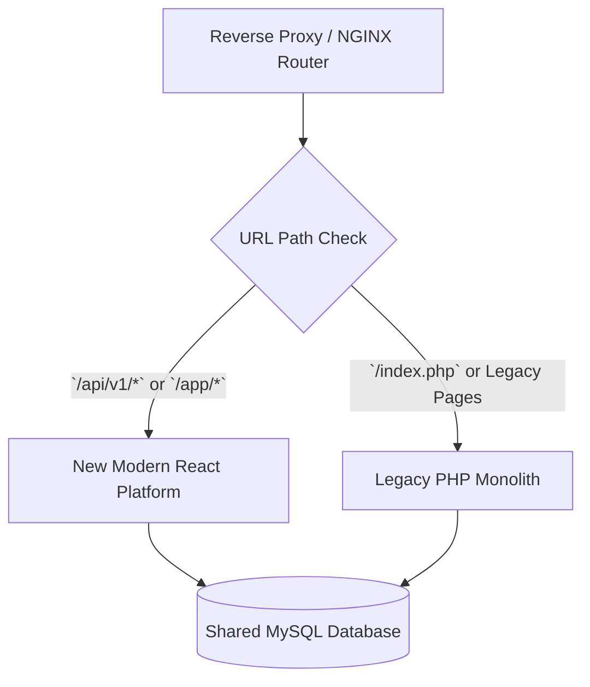
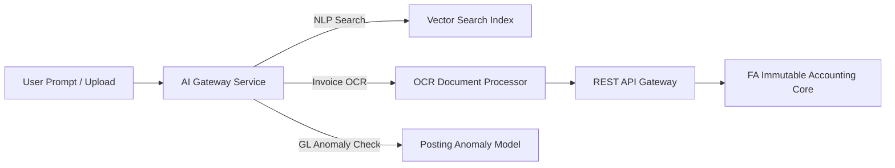

# Document 4: React Modernization Strategy & API Architecture

## FrontAccounting ERP v2.4.20 — Complete Modernization Study

---

# Part 1: Technology Stack Selection & Technical Justifications

The modernization stack has been selected to deliver maximum performance, strict type safety, long-term maintainability, and enterprise scalability:

```
┌─────────────────────────────────────────────────────────────────────────────────────────┐
│ REACT 19 + TYPESCRIPT 5.x FRONTEND STACK                                                │
├──────────────────────┬─────────────────────────────┬────────────────────────────────────┤
│ Technology           │ Library Choice              │ Technical Justification            │
├──────────────────────┼─────────────────────────────┼────────────────────────────────────┤
│ Build Tool           │ Vite                        │ Lightning-fast HMR, sub-second build│
│ Routing              │ TanStack Router             │ 100% Type-safe routing & search params│
│ Server State Cache   │ TanStack Query (v5)         │ Stale-while-revalidate, zero boilerplate│
│ UI Framework & Design│ Tailwind CSS + shadcn/ui    │ Full layout control, WCAG AA compliant│
│ Form Management      │ React Hook Form + Zod       │ High-performance form state & validation│
│ Data Grids           │ TanStack Table (v8)         │ Virtualized data grids for large ledgers│
│ Analytics / Charts   │ Recharts                    │ Responsive SVG financial visual charts│
│ Micro-Animations     │ Framer Motion               │ Smooth enterprise UI state transitions│
│ Document PDF Render  │ @react-pdf/renderer         │ Client-side live PDF print previews │
└──────────────────────┴─────────────────────────────┴────────────────────────────────────┘
```

---

# Part 2: REST API & OpenAPI 3.0 Architecture

To support the React SPA and future third-party integrations, FrontAccounting's procedural PHP scripts are exposed via a standardized REST API Gateway:



### API Design Principles
1. **JSON Specs**: All payloads formatted as `application/json` using standard HTTP status codes (`200 OK`, `201 Created`, `400 Bad Request`, `401 Unauthorized`, `403 Forbidden`, `422 Unprocessable Entity`).
2. **OpenAPI 3.0 Documentation**: Auto-generated Swagger UI endpoint specs allowing seamless client SDK generation.
3. **Cursor Pagination**: Replaces legacy SQL `OFFSET` pagination with high-performance cursor pagination for high-volume ledger queries.
4. **ETag & Caching**: HTTP ETag caching for static master data (chart of accounts, item categories, currencies).

---

# Part 3: React Application Architecture & Directory Layout

The React application follows a **Domain-Driven Feature Layout** to ensure clean separation of concerns:

```
src/
├── app/                        # Router configuration & root providers
│   ├── routes/                 # TanStack Router file-based routes
│   └── main.tsx                # Application entry point
├── assets/                     # Logos, fonts, static icons
├── components/                 # Shared UI Design System (shadcn/ui base)
│   ├── ui/                     # Buttons, Inputs, Dialogs, Tooltips
│   └── shared/                 # AccountSelector, CurrencyInput, DataTable
├── features/                   # Domain Modules (Colocated Logic)
│   ├── sales/                  # Sales Order, Invoices, Customers
│   │   ├── api/                # TanStack Query API hooks
│   │   ├── components/         # Sales-specific UI components
│   │   └── types/              # TypeScript interfaces & Zod schemas
│   ├── purchasing/             # POs, Supplier Bills, Vendors
│   ├── inventory/              # Items, Stock Adjustments, Transfers
│   ├── gl/                     # Journal Entries, Ledger, Bank Rec
│   └── reporting/              # Financial Reports & Print Views
├── hooks/                      # Global custom React hooks
├── lib/                        # API client (Axios/Fetch), utils, date formatters
├── stores/                     # Zustand global stores (Auth, Theme, Workspace)
└── types/                      # Shared system-wide TypeScript definitions
```

---

# Part 4: Incremental Migration Strategy — The Strangler Fig Pattern

To eliminate operational risk and prevent system downtime, the modernization employs the **Strangler Fig Migration Pattern**. The legacy PHP system and modern React platform operate side-by-side during the migration:



### 4-Phase Rollout Plan
1. **Phase 1 (Coexistence Layer)**: Deploy NGINX reverse proxy in front of legacy FrontAccounting. Implement REST API gateway and JWT auth.
2. **Phase 2 (Dashboard & Master Data)**: Deploy new React Dashboard, Customer Management, Supplier Management, and Item Catalog while leaving core posting in PHP.
3. **Phase 3 (Transaction Modules)**: Migrate Sales, Purchasing, and GL screens incrementally to React feature modules.
4. **Phase 4 (Legacy Decommissioning)**: Decommission legacy PHP HTML rendering logic while retaining core business posting include files as API backends.

---

# Part 5: AI Readiness Architecture

The platform architecture is designed for seamless future AI integrations **without touching core double-entry logic**:



### Future AI Capabilities
- **Natural Language ERP Assistant**: Query financial ledgers via chat ("Show total revenue for Q2 compared to Q1").
- **Automated Supplier Bill OCR**: Upload PDF supplier invoices; AI extracts vendor, line items, and taxes, creating draft bills automatically.
- **Smart Journal Anomaly Detection**: Highlights unusual debit/credit entries or uncommon account combinations before posting.

---

# Part 6: Extension & Plugin Architecture

The modernized platform provides an upgraded extension mechanism supporting both frontend and backend plugins:

```
┌─────────────────────────────────────────────────────────────────────────────────────────┐
│ EXTENSION ARCHITECTURE                                                                  │
├───────────────────────────────────┬─────────────────────────────────────────────────────┤
│ Plugin Layer                      │ Mechanism                                           │
├───────────────────────────────────┼─────────────────────────────────────────────────────┤
│ React Frontend Plugins            │ Slot-and-Fill Component Architecture                │
│ REST API Hooks                    │ PSR-14 Event Dispatcher (`db_prewrite`, `db_postwrite`)│
│ Custom Dashboard Widgets          │ Dynamic Widget Registration Pipeline                │
│ Custom Print Templates            │ Pluggable HTML5 / Tailwind Print Themes              │
└───────────────────────────────────┴─────────────────────────────────────────────────────┘
```

---

*End of Document 4. Next: Document 5 — Design System & Component Library.*
