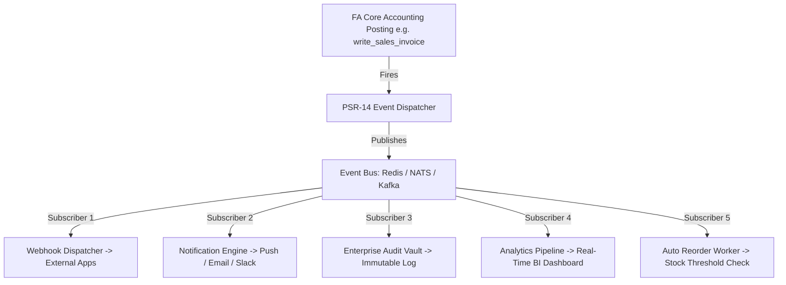
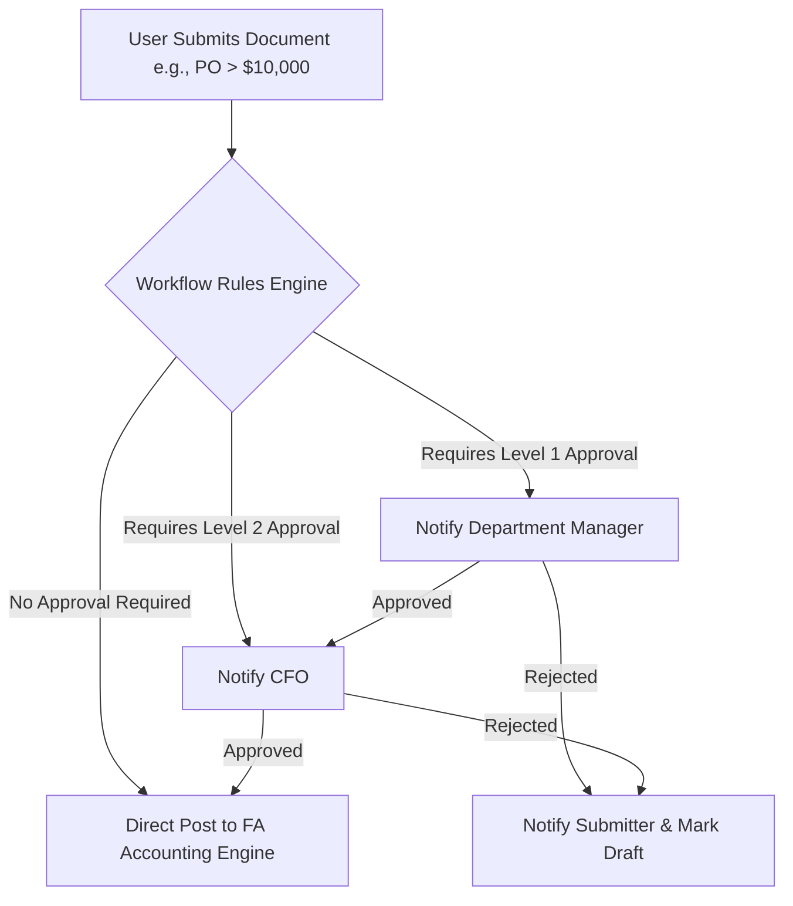
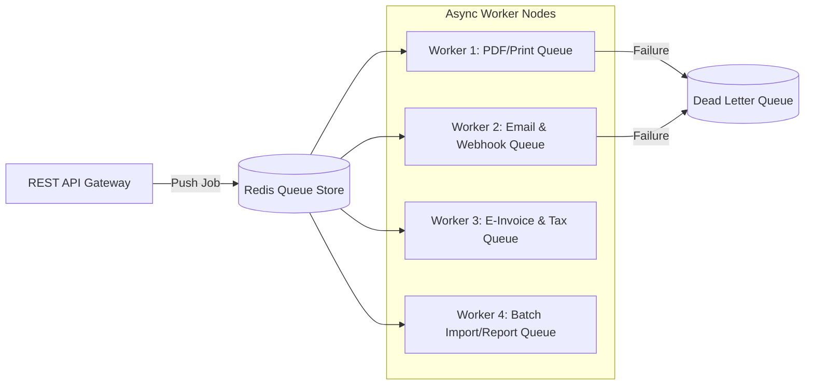
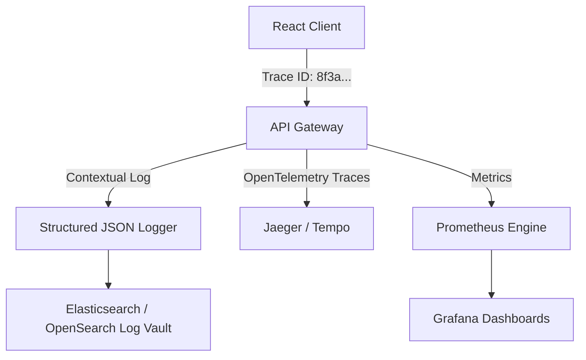

# Document 8: Enterprise Platform Architecture & Operational Excellence

## FrontAccounting ERP v2.4.20 — Complete Modernization Study

---

# Executive Vision: Transforming an ERP Application into an Enterprise Platform

> [!IMPORTANT]
> **Platform Paradigm Shift:** This document defines the operational foundation required to transform FrontAccounting from a standalone web application into a **Production-Grade, Multi-Tenant Enterprise ERP Platform**. By layering an **Event-Driven Bus**, **Configurable Workflow Engine**, **Async Worker Queues**, and **Observability Pipeline** over the immutable core accounting engine, we ensure high availability, seamless third-party integrations, and enterprise operational governance without modifying underlying accounting rules.

```
┌───────────────────────────────────────────────────────────────────────────────────────────┐
│ REACT 19 SPA PRESENTATION LAYER & COMMAND CENTER                                          │
└─────────────────────────────────────────────┬─────────────────────────────────────────────┘
                                              │ REST API / OpenAPI 3.0 (v1 / v2)
┌─────────────────────────────────────────────▼─────────────────────────────────────────────┐
│ ENTERPRISE PLATFORM SERVICES LAYER                                                        │
│ ┌───────────────────────────┐ ┌───────────────────────────┐ ┌───────────────────────────┐ │
│ │ Event Bus (Redis/Kafka)   │ │ Workflow Approval Engine  │ │ Async Queue Workers       │ │
│ └─────────────┬─────────────┘ └─────────────┬─────────────┘ └─────────────┬─────────────┘ │
│               │                             │                             │               │
│ ┌─────────────▼─────────────┐ ┌─────────────▼─────────────┐ ┌─────────────▼─────────────┐ │
│ │ Integration Connectors    │ │ OpenTelemetry & Logging   │ │ Webhook Dispatcher        │ │
│ └───────────────────────────┘ └───────────────────────────┘ └───────────────────────────┘ │
└─────────────────────────────────────────────┬─────────────────────────────────────────────┘
                                              │ Native PSR-14 Event Handlers / Repositories
┌─────────────────────────────────────────────▼─────────────────────────────────────────────┐
│ IMMUTABLE FRONTACCOUNTING CORE ACCOUNTING ENGINE (PHP 8.x Services)                        │
└─────────────────────────────────────────────┬─────────────────────────────────────────────┘
                                              │ MySQL 8.0 InnoDB + Binlog Replication
┌─────────────────────────────────────────────▼─────────────────────────────────────────────┐
│ HIGH-AVAILABILITY MULTI-TENANT DATA STORE                                                 │
└───────────────────────────────────────────────────────────────────────────────────────────┘
```

---

# Part 1: Event-Driven Architecture (EDA) & Domain Events

To decouple side-effects (notifications, integrations, audit logging, analytics) from transactional posting code, the platform introduces an **Event-Driven Architecture**:



### Core Domain Event Catalog

| Event Name | Trigger Condition | Payload Contents | Primary Event Subscribers |
|---|---|---|---|
| `InvoicePosted` | Sales Invoice written to GL | `invoice_id`, `debtor_no`, `amount`, `currency`, `tran_date`, `lines[]` | Webhook, Notification, E-Invoice Signer, Customer Portal |
| `PaymentAllocated` | Payment matched to invoice | `allocation_id`, `invoice_id`, `payment_id`, `amount`, `allocated_at` | AR Analytics, Aged Receivables Cache Invalidator |
| `StockAdjusted` | Inventory quantity modified | `stock_id`, `loc_code`, `qty_change`, `new_qoh`, `reason_code` | Reorder Threshold Checker, Warehouse Notification |
| `PurchaseOrderApproved`| PO exceeds threshold & approved | `po_id`, `supplier_id`, `total_amount`, `approver_user_id` | Supplier Email Dispatcher, GRN Receiving Queue |
| `GLJournalPosted` | Manual Journal written | `type`, `trans_no`, `total_debit`, `user_id`, `dimensions[]` | Audit Trail Vault, Compliance Monitor |
| `TaxReportGenerated` | Tax filing report finalized | `fiscal_period`, `tax_type_id`, `total_tax`, `generated_by` | Tax Authority Sync Connector, Archival Vault |

### Standard Domain Event Schema (JSON Schema)
```json
{
  "$schema": "http://json-schema.org/draft-07/schema#",
  "title": "DomainEvent",
  "type": "OBJECT",
  "properties": {
    "event_id": { "type": "STRING", "format": "uuid" },
    "event_name": { "type": "STRING", "example": "InvoicePosted" },
    "tenant_id": { "type": "INTEGER", "example": 0 },
    "timestamp": { "type": "STRING", "format": "date-time" },
    "producer": { "type": "STRING", "example": "fa-core-sales-service" },
    "correlation_id": { "type": "STRING", "format": "uuid" },
    "payload": { "type": "OBJECT" }
  },
  "required": ["event_id", "event_name", "tenant_id", "timestamp", "payload"]
}
```

---

# Part 2: Configurable Workflow & Approval Engine

Organizations require customizable approval chains for high-value transactions without altering underlying PHP posting routines. The platform introduces a **Decoupled Workflow State Machine**:



### Rule-Based Approval Policies Configuration (JSON)
```json
{
  "workflow_name": "High_Value_Purchase_Order_Approval",
  "target_entity": "ST_PURCHORDER",
  "enabled": true,
  "conditions": [
    { "field": "total_amount", "operator": ">=", "value": 10000.00 }
  ],
  "approval_chain": [
    { "step": 1, "role": "Department_Manager", "timeout_hours": 24 },
    { "step": 2, "role": "CFO", "timeout_hours": 48 }
  ],
  "on_rejection": "RETURN_TO_DRAFT",
  "escalation_policy": "NOTIFY_SYSTEM_ADMIN"
}
```

---

# Part 3: Enterprise Integration Architecture & Connectors

The platform provides an **Open Connector Framework** for external systems:

```
┌───────────────────────────────────────────────────────────────────────────────────────────┐
│ OPEN CONNECTOR FRAMEWORK                                                                 │
├───────────────────┬───────────────────────────────────┬───────────────────────────────────┤
│ Connector Category│ Supported Protocols & Standards   │ Business Function                 │
├───────────────────┼───────────────────────────────────┼───────────────────────────────────┤
│ Open Banking      │ Plaid, ISO 20022 (CAMT.053/MT940) │ Live bank statement auto-import   │
│ Tax Authorities   │ PEPPOL, ZATCA, MTD, SAF-T         │ E-invoicing & real-time clearance │
│ Payment Gateways  │ Stripe, PayPal, Square, ACH       │ Embedded customer invoice payment │
│ POS & Hardware    │ ESC/POS Thermal, WebUSB Barcodes  │ Retail checkout & warehouse scan  │
│ External Systems  │ Outgoing HMAC Webhooks, REST API  │ CRM (HubSpot/Salesforce) sync     │
└───────────────────┴───────────────────────────────────┴───────────────────────────────────┘
```

### Outgoing Webhook Engine
- **HMAC Signatures**: Every payload signed using `SHA-256` digest via `X-ERP-Signature` header.
- **Exponential Backoff Retry**: Failed endpoint deliveries retried automatically (1m, 5m, 15m, 1h, 24h).
- **Webhook Management Dashboard**: View delivery status, payload history, and resend failed webhooks with 1 click.

---

# Part 4: Async Background Processing & Queue Architecture

Heavy computations, PDF batch generation, and external API requests are offloaded to **Redis-backed Worker Queues**:



### Queue Pool Definitions
1. **`high-priority`**: Payment gateway webhooks, instant SMS alerts (Timeout: 5s).
2. **`default`**: Email dispatches, document status updates (Timeout: 30s).
3. **`reports`**: Financial statement rendering, large Excel exports (Timeout: 300s).
4. **`e-invoicing`**: Regulatory clearance requests, digital signatures (Timeout: 60s).

---

# Part 5: Observability, Monitoring & Auditing

Enterprise operational governance requires full visibility into system health, performance, and user activities:



### 1. Structured JSON Logging Format
All system events log context-rich JSON payloads:
```json
{
  "timestamp": "2026-07-27T20:30:00.124Z",
  "level": "INFO",
  "correlation_id": "8f3a-92bc-41fe-9021",
  "tenant_id": 0,
  "user_id": 4,
  "action": "SALES_INVOICE_POSTED",
  "ip_address": "192.168.1.100",
  "duration_ms": 42.8,
  "context": {
    "trans_type": 10,
    "trans_no": 2042,
    "customer_id": 12,
    "amount": 2645.50
  }
}
```

### 2. Standard System Health Checks
- `GET /health/live`: Liveness check (verifies HTTP web server is running).
- `GET /health/ready`: Readiness check (verifies MySQL connection, Redis connection, and writable file system).
- `GET /health/startup`: Startup check (verifies database migrations are up to date).

---

# Part 6: API & Database Versioning Strategy

To guarantee continuous zero-downtime upgrades:

```
┌───────────────────────────────────────────────────────────────────────────────────────────┐
│ VERSIONING & MIGRATION POLICY                                                             │
├───────────────────┬───────────────────────────────────────────────────────────────────────┤
│ Policy            │ Implementation Strategy                                               │
├───────────────────┼───────────────────────────────────────────────────────────────────────┤
│ API Versioning    │ URL Path Versioning (`/api/v1/...`, `/api/v2/...`) + `Sunset` Headers│
│ Deprecation SLA   │ 12-month deprecation window before breaking API version removal        │
│ Schema Migrations │ Expand and Contract Pattern (Add non-null column -> Dual write -> Drop)│
│ Database Tooling  │ Phased Migration Scripts (`sql/alter2.4.php` modernized via Phinx/Flyway)│
└───────────────────┴───────────────────────────────────────────────────────────────────────┘
```

---

# Part 7: Disaster Recovery & Business Continuity

```
┌───────────────────────────────────────────────────────────────────────────────────────────┐
│ DISASTER RECOVERY TARGETS                                                                 │
├───────────────────────────────────┬───────────────────────────────────────────────────────┤
│ Metric                            │ Target Level                                          │
├───────────────────────────────────┼───────────────────────────────────────────────────────┤
│ Recovery Point Objective (RPO)    │ <= 1 Minute (Near-zero data loss via MySQL Binlogs)   │
│ Recovery Time Objective (RTO)     │ <= 15 Minutes (Automated Kubernetes Failover)         │
│ Backup Frequency                  │ Hourly incremental binlogs + Daily full snapshots     │
│ Backup Verification               │ Weekly automated restore test drill into isolated sandbox│
└───────────────────────────────────┴───────────────────────────────────────────────────────┘
```

### Point-in-Time Recovery (PITR) Pipeline
1. **Primary Master** streams MySQL binary logs (`binlog`) to encrypted Cloud Object Storage (S3/GCS).
2. Daily automated full database snapshots taken at 02:00 UTC.
3. Recovery scenario: Restore latest daily snapshot, then replay binary logs up to exact minute before incident (`--stop-datetime="2026-07-27 14:02:00"`).

---

# Part 8: Comprehensive Enterprise Testing Pyramid

Quality assurance spans 7 automated testing layers to guarantee financial correctness:

```
                      / \
                     / E2E \          <- 1. Playwright Full O2C / P2P Journeys (10%)
                    /-------\
                   /  Load   \        <- 2. k6 / Locust 1,000 User Stress Tests (10%)
                  /-----------\
                 / Contract &   \     <- 3. Pact / OpenAPI Schema Tests (15%)
                /  Security      \    <- 4. OWASP ZAP & axe-core Scans (15%)
               /------------------\
              /    Integration     \  <- 5. PHPUnit DB Repository Tests (20%)
             /----------------------\
            /      Unit Testing      \ <- 6. PHPUnit Core Math & Vitest React (30%)
           └──────────────────────────┘
```

---

# Part 9: DevOps, Infrastructure as Code & Enterprise Governance

```
┌───────────────────────────────────────────────────────────────────────────────────────────┐
│ DEVOPS & GOVERNANCE STACK                                                                 │
├───────────────────┬───────────────────────────────────────────────────────────────────────┤
│ Governance Area   │ Technology / Strategy                                                 │
├───────────────────┼───────────────────────────────────────────────────────────────────────┤
│ Infrastructure    │ Terraform (AWS/Azure/GCP provision) + Helm Charts (Kubernetes)        │
│ CI/CD Pipeline    │ GitHub Actions (Lint -> Unit Test -> Integration Test -> Build -> K8s) │
│ Feature Flags     │ Unleash / LaunchDarkly pattern (Gradual feature rollout per tenant)   │
│ Performance Budget│ Max bundle size < 250KB gzipped, p95 API response < 150ms, LCP < 1.2s │
│ Compliance & Privacy│ GDPR Data Export API, Automatic Anonymization of deleted customers    │
└───────────────────┴───────────────────────────────────────────────────────────────────────┘
```

---

*End of Document 8. Complete Enterprise Modernization Blueprint Finished.*
